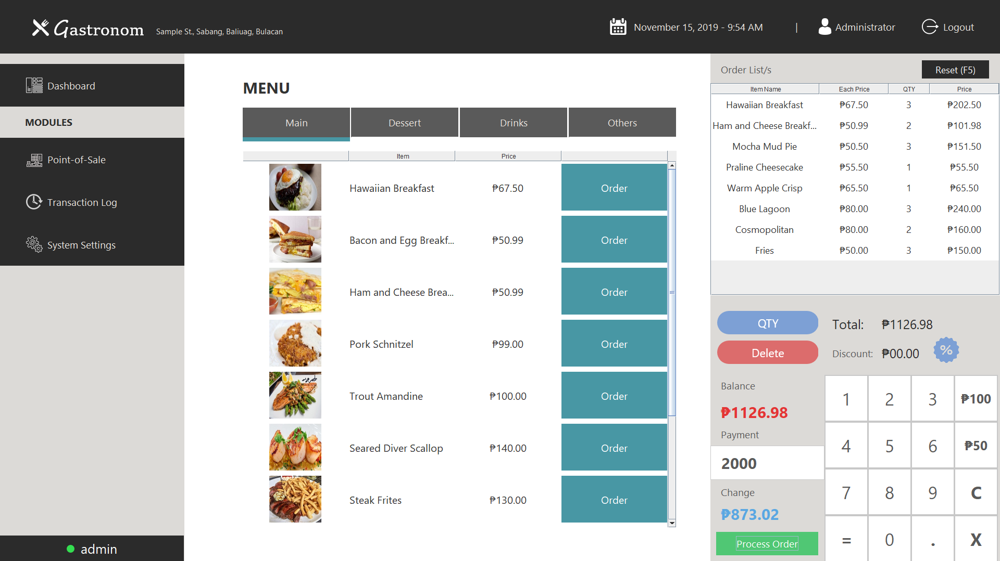
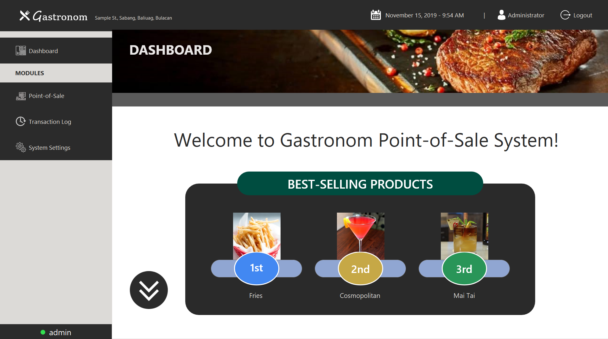
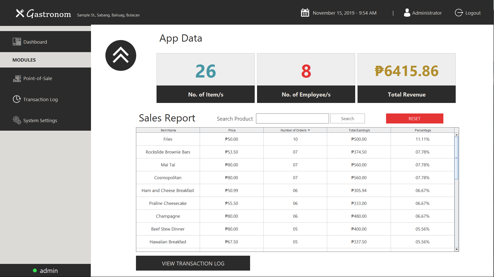
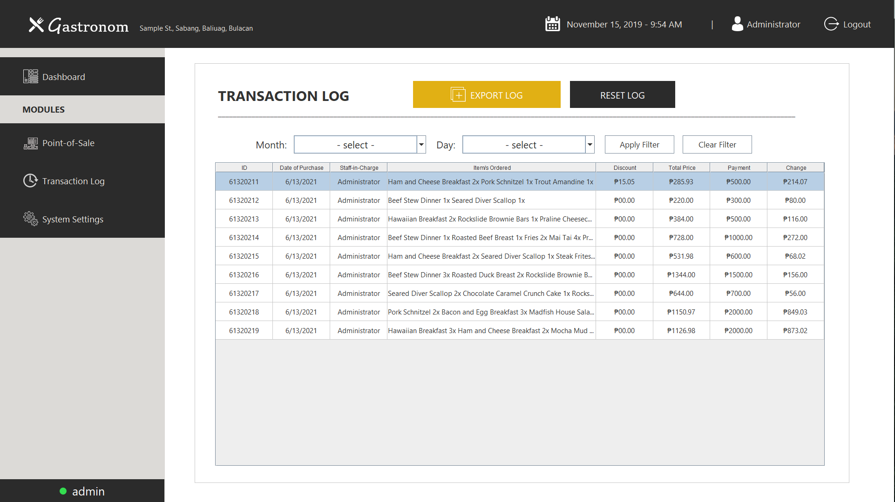
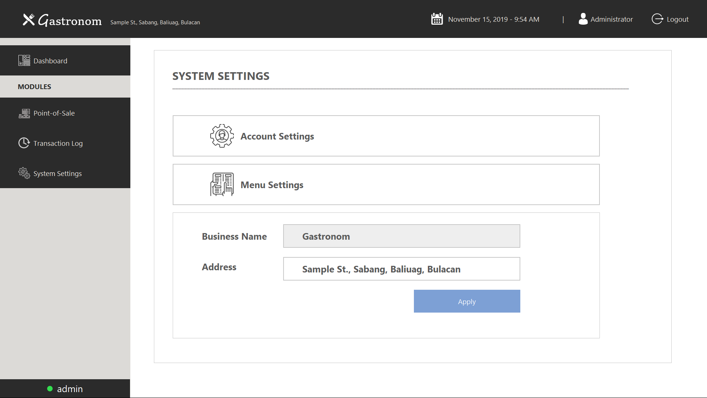
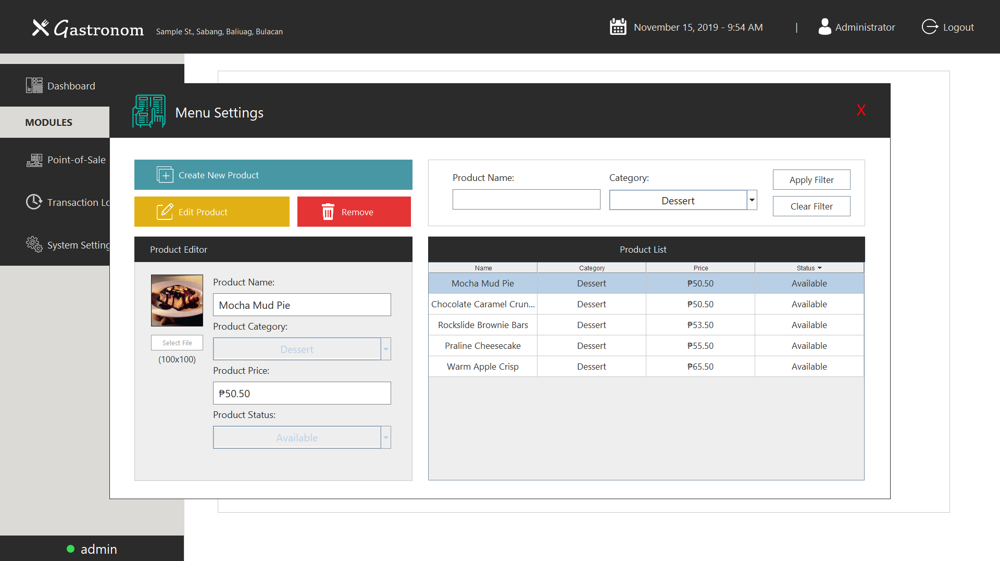

# GastronomPOS

Gastronom is a point-of-sale windows application developed using Java and Swing.  
This is a school project and the professor prohibits the use of databases so this is just a pure java application.

# Screenshot

## Login

## Point of Sale

## Dashboard

## Transaction Log

## System Settings

